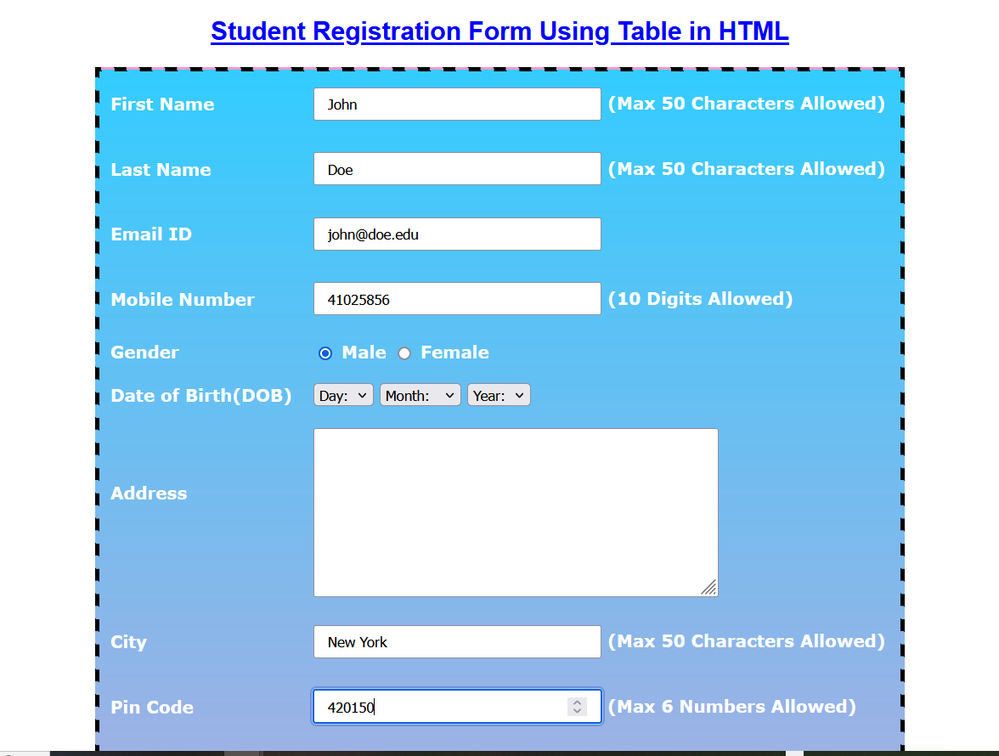

## Project Overview

This project demonstrates the process of packaging a Java application and deploying it to an Apache Tomcat server using a fully automated CI/CD pipeline. The pipeline is built with Jenkins, leveraging Maven for build management and Nexus for artifact repository management.
Key Components

Maven: Used for compiling the code, running tests, and packaging the application into a WAR file.
Nexus: Serves as the artifact repository where the packaged application is stored.
Jenkins: Automates the build, test, and deployment processes through a Jenkins pipeline.
Tomcat: The application server where the Java application is deployed and run.

Pipeline Workflow

Code Checkout: Jenkins checks out the latest code from the version control system (e.g., Git).
Build and Package: Maven compiles the source code, runs tests, and packages the application into a WAR file.
Artifact Deployment: The WAR file is uploaded to the Nexus repository.
Deployment to Tomcat: Jenkins deploys the WAR file from Nexus to the Tomcat server.

This setup ensures a robust and automated deployment pipeline for Java applications, providing continuous integration and delivery capabilities.

# Registration-Form
